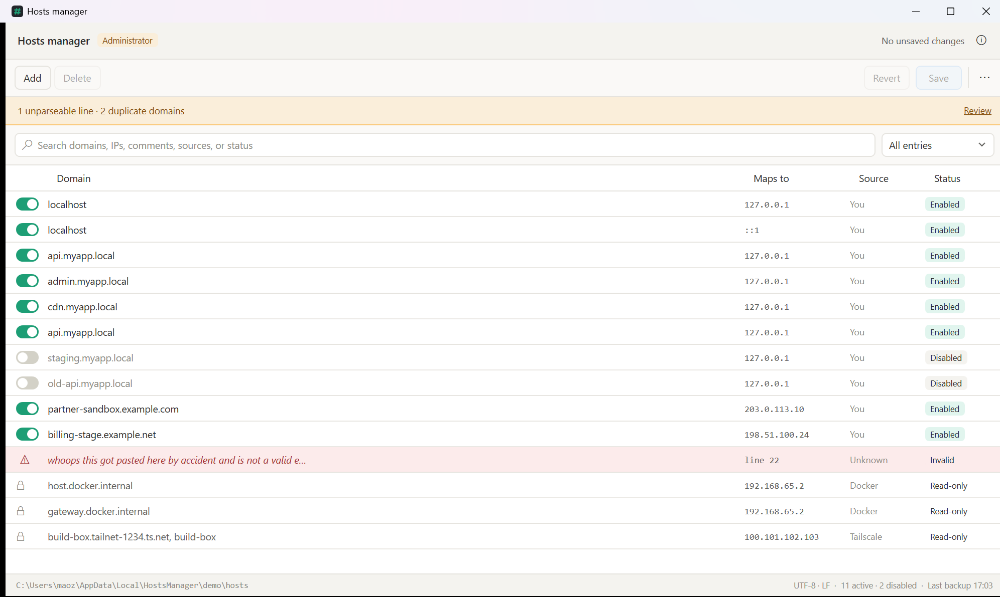

# Hosts manager

A Windows desktop app for managing `C:\Windows\System32\drivers\etc\hosts` — add, remove and
toggle domain overrides without hand-editing a system file in an elevated text editor.

Built because hand-editing had already gone wrong: the hosts file on this machine contained a
paragraph of chat text pasted in by accident. Windows silently ignores lines it can't parse, so
that kind of corruption stays invisible until something stops resolving.



*Shown with example data — none of the domains or IPs above are real.*

## What it does

- **Toggle any domain on or off** with a switch. Disabling comments the line out; enabling
  uncomments it. Nothing else on the line changes.
- **Open a domain in an isolated Edge or Chrome window** where its mapping applies only
  to that browser. Windows DNS, the hosts file, and your normal browser stay untouched.
- **Add and remove entries** with live validation — you see the exact line that will be written
  before it is written.
- **Import or merge another hosts file.** Import replaces only editable entries while preserving
  local comments and tool-owned sections; merge adds new hostnames and skips duplicates. Both stay
  pending until you save.
- **Organize entries into groups** such as Work or Local development. Groups can be filtered,
  searched, renamed, and enabled or disabled together; they travel with the hosts file as harmless
  namespaced comments.
- **Search and sort the table** without reordering the file. Search covers domains, IP addresses,
  comments, source, group and status; each data column can be sorted in either direction.
- **Flags unparseable lines** that Windows silently ignores, with the line number, so junk is
  visible and one click from being removed.
- **Flags duplicate domains**, which Windows resolves first-match-wins, so later ones are dead.
- **Leaves other tools alone.** Docker Desktop and Tailscale blocks are shown read-only and are
  never rewritten.
- **Backs up before every save**, keeps a permanent copy of the original, and can restore either.
- **Lives in the notification area.** Closing the window hides it there; a themed tray
  menu — matching the app, not stock OS chrome — can toggle any domain without opening
  the app at all.
- **Follows your Windows light/dark setting**, including the title bar, and switches live.
- **Runs as a single instance**, so two copies can't fight over the same file.
- **Shows its version in an About dialog** (the ⓘ icon in the header, or the tray menu),
  read from the running exe so it always matches what's actually installed.

## Installing

**Requires Windows 11 or later**, and the installer enforces it. The bundled .NET 8 runtime
would technically also run on Windows 10 1607+, but this is only developed and tested
against Windows 11, so the installer refuses rather than putting the app somewhere it has
never been exercised. Windows 7 and 8.1 can't run it at all —
[.NET 8 dropped them](https://learn.microsoft.com/en-us/dotnet/core/install/windows#supported-versions).

Every file is named `HostsManager-<version>-<arch>-<kind>`, so a download still says what
it is after it leaves the release page. **Setup** installs; **Portable** just runs.

Grab the **`-Setup.msi`** matching your CPU from `dist` — this is the installer. It puts
the app in Program Files, adds a Start Menu shortcut, and registers an uninstall entry:

| CPU | Installer |
| --- | --- |
| 64-bit Intel or AMD | `HostsManager-<version>-x64-Setup.msi` |
| ARM (Surface, Snapdragon) | `HostsManager-<version>-arm64-Setup.msi` |
| 32-bit Intel | `HostsManager-<version>-x86-Setup.msi` |

Each is self-contained — no .NET runtime needed on the target machine.

A matching `HostsManager-<version>-<arch>-Portable.exe` sits alongside each installer.
That's the **portable** build — the same app, run directly with no install step. It's
deliberately not an installer: running it does not touch Program Files, does not add a
Start Menu entry, and there is no wizard to show, because nothing is being installed. If
you double-click it expecting installer behaviour, that's why nothing seems to happen —
use the `-Setup.msi` instead.

Not sure which CPU you need? `echo %PROCESSOR_ARCHITECTURE%` reports `AMD64`, `ARM64` or
`x86`.

Neither build is code-signed (no certificate for this project), so Windows will likely
show a SmartScreen "Windows protected your PC" prompt on first run. Click **More info**,
then **Run anyway** — that's expected for any unsigned executable from an unrecognized
publisher, not a sign anything is broken.

Uninstalling removes the app but deliberately leaves your backups in place.

## Administrator rights

The hosts file lives in `System32` and is owned by `BUILTIN\Administrators`, so writing to
it requires elevation. Hosts Manager itself runs as the ordinary desktop user, so browsing
entries and opening an isolated Edge or Chrome window does not need UAC. Saving, restoring,
or toggling from the tray starts a short-lived elevated copy that performs only that
hosts-file write and exits.

The elevated helper accepts only the real Windows hosts path. An authenticated local pipe
connects it to the initiating process, including when UAC uses another administrator account.
Backup operations run under the initiating user's identity and retain the configured backup root.
The helper independently verifies content, drift, target provenance, and final bytes and access rules.

Two other deliberate consequences:

- Saves use `File.Replace`, which **preserves the hosts file's original ACLs**. A plain
  overwrite from an elevated process can leave the file with different permissions than
  Windows shipped it with. If a security product blocks `File.Replace` outright, the
  fallback is a move — which would otherwise hand the file the temp file's permissions, so
  the original access rules are captured beforehand and reapplied. If they can't be
  captured, applied to the temporary file, and verified, the replacement is refused.
- Backups go to `%LOCALAPPDATA%`, **not** under `System32`. That keeps them readable and
  available without elevation. Restoring into the system hosts file still requires elevation.

To rehearse changes without elevation, point the app at a copy. Custom paths are written
directly by the ordinary process and never invoke the elevated helper:

```bash
dotnet build src/HostsManager/HostsManager.csproj -o build
```

```bash
build/HostsManager.exe --hosts-path C:\temp\hosts-copy --backups-dir C:\temp\backups
```

## Building from source

```bash
./installer/build.ps1
```

Publishes every architecture and builds the installers into `dist`. Requires the WiX 5
CLI (`dotnet tool install --global wix --version 5.0.2` plus
`wix extension add -g WixToolset.UI.wixext/5.0.2` and
`wix extension add -g WixToolset.Util.wixext/5.0.2`).

.NET cannot emit one binary that runs on every CPU, so each architecture gets its own
executable and installer.

### Releasing an update

Bump `<Version>` in [Directory.Build.props](Directory.Build.props) and run the build
script again — that's the whole release process. All three installers share one
`UpgradeCode`, so installing a build with a higher version over an existing install
replaces it in place rather than adding a second entry in Programs and Features. To
build a specific version without editing the file: `./installer/build.ps1 -Version 1.2.0`.

Keep versions to three numeric parts (`Major.Minor.Build`) — Windows Installer ignores a
fourth field when comparing versions, so a change there wouldn't register as an upgrade.

### Command line

| Flag | Effect |
| --- | --- |
| `--hosts-path <path>` | Use a different hosts file. For rehearsing against a copy. |
| `--backups-dir <path>` | Use a different backup directory. |
| `--theme light\|dark` | Pin the theme instead of following Windows. |
| `--restore-latest` | Restore the most recent backup, no UI. |
| `--restore-original` | Restore the pristine pre-app original, no UI. |

## Isolated browser preview

Select any valid entry — active, disabled, or read-only — or use Ctrl/Shift to select
several. Right-click the selection or use the toolbar's overflow menu and choose **Open in
isolation**. Hosts manager launches one Edge or Chrome window with a dedicated browser
profile, a tab for every checked start page, and resolver rules for every hostname on the
selected entries. Conflicting mappings for the same hostname are refused rather than
silently choosing one. This is useful for opening production hostnames against local or
staging servers while the rest of the machine continues using normal DNS.

The preview dialog includes checkboxes for **Ignore certificate errors**, **Disable web
security (CORS)**, **Allow insecure content**, **Open DevTools**, **Private browsing**
(Chrome Incognito / Edge InPrivate), and **Disable extensions**. All start unchecked.
The first three reduce security and are intended for testing trusted sites in the isolated
browser. Hover over an option for a description.

Use **Additional flags** in the preview dialog to pass extra Chromium startup switches to
Edge or Chrome. Enter one flag per line, such as `--disable-extensions` or
`--auto-open-devtools-for-tabs`. Use `--name=value` for values; spaces are preserved and
surrounding quotes are unnecessary. Duplicate flags and switches managed by Hosts Manager
(including the profile directory and hostname resolver rules) are rejected. Flags from the
last successful launch are remembered until Hosts Manager closes. Different flag configurations
use separate isolated profiles so an existing browser process cannot ignore changed flags.

The preview never writes the hosts file. Certificate validation stays enabled by default;
custom flags can change browser behavior. The URL hostname is preserved, so the target server
normally needs to present the correct HTTPS certificate. Hosts Manager and the browser both run with the desktop user's normal token;
if Hosts Manager was manually started as administrator, browser preview is refused with an
instruction to restart normally rather than attempting to manufacture a downgraded token.

The restore flags bypass the single-instance guard on purpose: they're what you reach for
when something is already wrong, so they must never be refused.

## Import and merge

Use **More actions → Import entries** to replace the current file's editable mappings with
the valid editable mappings from another hosts file. Comments, blank lines, unparseable text,
and Docker/Tailscale blocks in the current file remain untouched. Tool-managed entries and
unparseable lines from the source are reported and skipped.

Use **Merge entries** to add mappings without replacing anything. A hostname already present in
the current file — active or disabled, case-insensitively and with an optional trailing dot — is
skipped. If an imported line contains a mixture of existing and new aliases, only its new aliases
are added. Imported enabled/disabled state and inline comments are retained.

Neither operation saves automatically. The result appears as ordinary pending changes, so it can
be reviewed, filtered, sorted, reverted, and then committed through the same verified save pipeline
as a hand-added entry.

## Groups

Select one or more editable entries and choose **Groups** in the toolbar. From there, create a group,
assign the selection to an existing group, or remove it from its current group. The same dialog shows
whether every group is enabled, disabled, or mixed, and can enable or disable every member together.
Deleting a group never deletes its entries; they simply become ungrouped.

The Group dropdown combines with the existing text and problem/loopback filters. Source remains a
separate concept: it shows who owns an entry, while Group is user-defined organization. Entries owned
by Docker Desktop or Tailscale remain read-only and cannot be grouped.

Groups are portable because they are stored as comments Windows already ignores:

```text
# HostsManager: group Local development
127.0.0.1 api.local
#127.0.0.1 old-api.local
# HostsManager: end-group
```

Imported and merged files containing these markers preserve their groups. Ordinary hosts files work
as before and their entries arrive ungrouped.

## How the file is protected

There is no Windows API for the hosts file — it is plain text, and every tool that manages it
(including this one) rewrites the whole file. Safety comes from the pipeline, not from who does
the writing. Every save passes through these gates; failures after replacement report the
verified recovery outcome:

1. **Drift check** — if the file changed on disk since it was loaded (Docker and Tailscale rewrite
   it on their own schedule), the save is refused rather than clobbering those changes.
2. **Render** from the line model. Lines you didn't touch are emitted from their original text
   verbatim.
3. **Re-parse and verify** — the rendered text is parsed back and compared line by line against
   the model it came from. A render bug fails here, in memory, instead of reaching disk.
4. **Structural checks** — no null bytes, no lost trailing newline. Managed sections are
   independently compared with the actual destination baseline, including boundaries and line endings.
5. **Backup** — if the backup can't be written, the save doesn't happen.
6. **Atomic replace** — written to a temp file, flushed to physical disk, then swapped in with
   `File.Replace` with strict metadata handling. Windows access rules are captured, applied
   to the temporary file and verified; the fallback move requires the same checks.
7. **Read back** — the bytes on disk are hashed and compared to what was meant to be written. A
   mismatch or changed access rules triggers recovery. A detected external edit is retained.

Save and restore share the backup, replacement and recovery routine. A per-target system-wide
lock serializes cooperating writers, with another drift check immediately before replacement.
Unrelated tools do not take that lock, so a final race remains possible. Recovery never
overwrites detected external content and identifies the recovery backup if it cannot restore safely.
An explicit restore verifies the selected backup's target and recorded hash; it may deliberately
change managed sections and does not require the old load hash. Late drift checks still apply.

The file's **UTF-8 BOM and CRLF line endings are preserved exactly**, never normalized. The status
bar shows the detected encoding as visible proof.

## Backups

Stored under `%LOCALAPPDATA%\HostsManager\backups\targets\<target-key>`, with a separate history
for each canonical target path. `--backups-dir` changes the root, retaining this separation.
Backups remain readable without elevation; writing the system hosts file requires elevation.

- A backup is taken **before every save**, and before every restore, so a restore can be undone.
- `hosts.original.bak` captures the first state recorded in that target's history and is **never pruned**.
- The last 50 timestamped backups are kept; each has a `.json` manifest recording the timestamp,
  SHA-256, target path, size, encoding and what triggered it. Files are created exclusively.
- Older files in the backup root remain available through **Earlier backups**. Their target
  is unknown, so inspect them before importing; they are never silently adopted as an Original.
- Missing or invalid metadata prevents automatic restore. Original/Latest commands report
  when no compatible backup exists instead of creating a new Original during recovery.

### Recovering without the app

Backups are plain text. Use the exact target-specific path shown in **Backups**, check its
manifest and content, then copy from an elevated Command Prompt:

```bash
copy /Y "C:\path-from-backups-dialog\hosts.original.bak" "%WINDIR%\System32\drivers\etc\hosts"
```

Or run `HostsManager.exe --restore-original`.

Don't rely on System Restore or Volume Shadow Copy for this file — there's no guarantee it's captured.

## Project layout

```
src/HostsManager.Core     Parsing, validation, backups, the write pipeline. No UI dependency.
src/HostsManager          WPF app, tray icon, theming.
tests/HostsManager.Tests  Core regression tests run against a real hosts file as a fixture.
installer                 WiX definition and the build script.
dist                      Installers and standalone executables.
docs                      Design rationale and decision log — see below.
```

- [docs/design.md](docs/design.md) — the core architecture: the line model, the safe-write
  pipeline, backup and recovery, validation rules.
- [docs/decisions.md](docs/decisions.md) — a log of non-obvious choices and why, including
  what a later code review found and fixed.

```bash
dotnet test
```

The load-bearing test is that parsing and re-rendering the real hosts file — BOM, CRLF, Microsoft
header, disabled entries, pasted junk, Docker and Tailscale blocks — produces **byte-identical**
output.

## Known behaviour

The tray icon starts in Windows 11's hidden-icons overflow, like every other new tray
icon. Drag it onto the taskbar via **Taskbar settings → Other system tray icons** to keep
it visible.

Toggling from the tray saves immediately, since there's no Save button out there. If the
window has unsaved changes the tray toggles are disabled instead — saving from the tray
would also commit whatever is pending in the window, which isn't what you asked for.


Enabling an entry that was written as `#⇥127.0.0.1 host` (with whitespace between the `#` and the
IP) and then disabling it again in a **later session** writes back a plain `#127.0.0.1 host`. Once
the line is enabled on disk that whitespace no longer exists anywhere, so it can't be recovered.
Within a single session, including across saves, the original prefix is preserved exactly.
