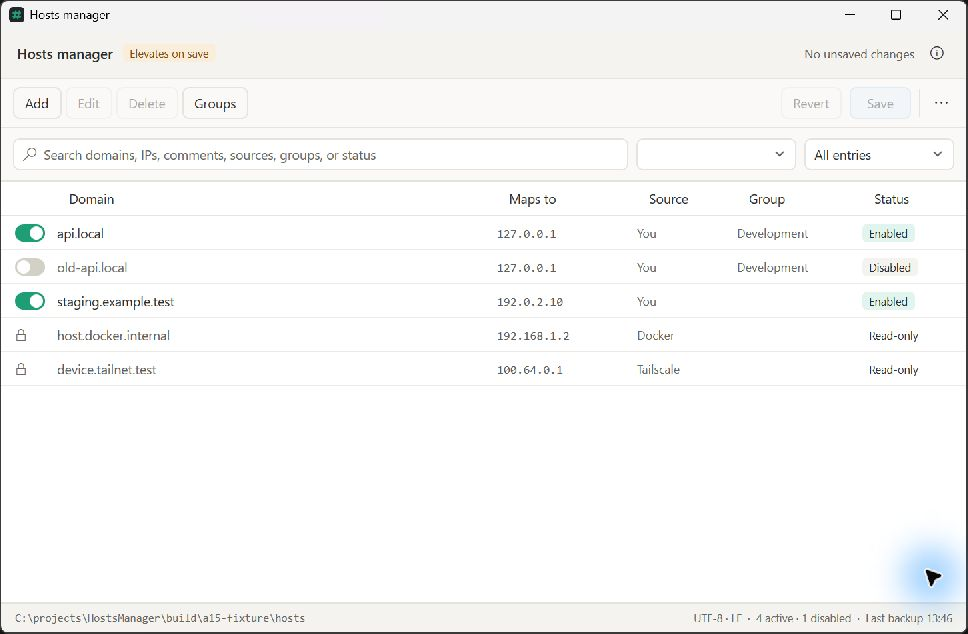

# A15–A18 implementation and validation

17 September 2026. Release scope: A15, A16, A17 and A18.

## Implementation

- A15: Edit toolbar/context action and grid F2 shortcut reuse entry validation. Token edits
  retain row position, group, disabled prefix and unrelated formatting. Managed rows remain
  protected. Existing duplicate flags refresh; full alias/dual-stack semantics remain A09.
- A16: Accessible names on primary controls and row toggles, visible keyboard focus,
  stronger muted text in both themes, Ctrl+F search, grid-scoped Delete and F2, horizontal grid
  scrolling, named tray actions and initial tray keyboard focus. Refreshed light screenshot.
- A17: More actions → Browser preview data lists retained app profiles and paths. Cleanup
  requires selecting a profile and confirming data loss. It accepts only app-owned Edge/Chrome
  twelve-hex-character profile directories, rejects linked paths and checks all matching
  browser processes. Normal browser processes also block cleanup deliberately. Process-query
  errors fail closed. A shared mutex coordinates cleanup and launch in this Windows session.
  Existing legacy profiles matching the established layout remain manageable. No automatic
  cleanup occurs and no actual user profile data was deleted during development.
- A18: Exact SDK policy, local WiX, NuGet locks, weekly dependency checks, architecture CI,
  checksum generation/verification and draft-first release publication with remote digest checks.

## Automated validation

218 tests passed, including edit formatting/group/state/validation/managed protections,
save/reload, selected-profile deletion, invalid-path rejection, active-browser refusal and
process-query failure. Desktop build passed with zero warnings/errors. Locked solution restore
passed; all three architectures packaged with locked dependencies. Checksum verifier accepted
a valid disposable artifact and rejected modified bytes.

## Manual accessibility and desktop matrix

| Scenario | Result |
| --- | --- |
| Light theme, fixture entries, current desktop scale | Window inspected and screenshot refreshed |
| Disabled grouped row → F2 | Edit dialog opens with original values and disabled preview |
| Grid keyboard focus | Visible focus observed during Tab navigation |
| Accessible names | Main controls, row toggles and edit fields exposed in automation tree |
| Modal Cancel | Confirmed returns to main window with no unsaved changes |
| Apply / UI save | Unverified through UI; core edit/save covered by tests |
| Profile manager | Opened from More actions; existing profiles and storage path displayed; Delete disabled without selection |
| Dark theme, all dialogs | Unverified |
| Screen reader announcement and reading order | Unverified |
| 100%, 150%, 200% DPI, moving across displays | Unverified |
| Tray activation, Tab/Enter/Escape on actual taskbar | Unverified; source changes compiled |
| Profile deletion through UI with real browser processes | Unverified; core policy covered by tests |

The native ARM64 development build was launched against a disposable hosts file. x64/x86
portable startup, and fresh install/upgrade/uninstall on all architectures remain unverified.
The system hosts file and existing browser profiles were not changed by validation.

A15/A17 implementation and regression checks are complete. A16 remains partially verified;
do not interpret the selection checkboxes as full accessibility certification. A18's manual
platform matrix remains a release follow-up. A06 alternate-account UAC also remains unverified.

